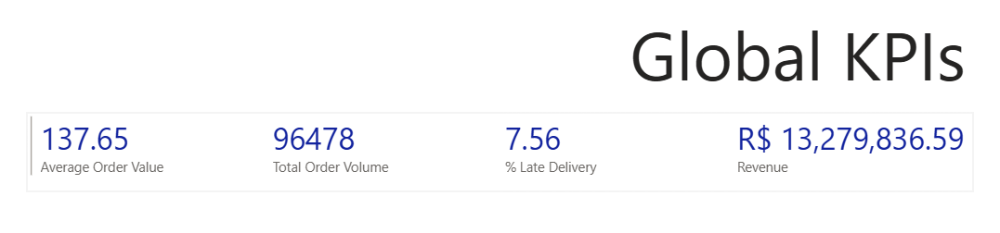

# Brazilian E-Commerce Analytics: End-to-End Big Data Pipeline

## Project Overview

This project builds a fully containerized, end-to-end Big Data pipeline to analyze real-world e-commerce data. It extracts raw data from a distributed file system, processes and enriches it using an in-memory compute engine, applies a machine learning model to predict logistical bottlenecks, and serves pre-aggregated Key Performance Indicators (KPIs) to a business intelligence dashboard.

The system maps directly to descriptive, predictive, and prescriptive analytics expectations, identifying how freight costs, geography, and package volume impact delivery times and customer satisfaction.

## The Dataset

We utilize the **Olist Brazilian E-Commerce Dataset** (via Kaggle), which contains over 100,000 anonymized orders made at multiple marketplaces in Brazil from 2016 to 2018. Its relational structure provides a comprehensive view of the e-commerce lifecycle, spanning multiple CSV files containing data on customers, order statuses, product dimensions, freight values, and customer reviews.

## Architecture & Technologies

- **Containerization:** Docker & Docker Compose
- **Storage (Data Lake):** Apache Hadoop (HDFS) - Raw & Curated Zones
- **Processing, ETL & Machine Learning:** Apache Spark (PySpark 3.5.0)
- **Serving / Query Layer:** MongoDB (via Spark-MongoDB v10 Connector)
- **Visualization:** Power BI

---

## Step-by-Step Execution Guide

Follow these steps to recreate the entire pipeline from scratch.

### 1. Start the Docker Environment

Spin up the HDFS NameNode, DataNode, Spark Master, Spark Worker, and MongoDB containers.

```bash
docker-compose up -d --build
```

(Wait 1-2 minutes for the Hadoop cluster to fully elect a leader and start up).

### 2. Prepare HDFS Directories

Create the Raw and Curated zones within the Hadoop Distributed File System.

```
docker exec -it namenode hdfs dfs -mkdir -p /raw/olist
docker exec -it namenode hdfs dfs -mkdir -p /curated/olist
```

### 3. Ingest Raw Data into HDFS

Load the raw Kaggle CSV files from the local mapped volume directly into the HDFS Raw Zone.

```
docker exec -it namenode hdfs dfs -put /dataset/olist_orders_dataset.csv /raw/olist/
docker exec -it namenode hdfs dfs -put /dataset/olist_order_items_dataset.csv /raw/olist/
docker exec -it namenode hdfs dfs -put /dataset/olist_customers_dataset.csv /raw/olist/
docker exec -it namenode hdfs dfs -put /dataset/olist_products_dataset.csv /raw/olist/
docker exec -it namenode hdfs dfs -put /dataset/olist_order_reviews_dataset.csv /raw/olist/
```

### 4. Grant HDFS Write Permissions

Allow the Spark processing user (UID 185) to write the cleaned Parquet files into the Curated Zone.

```
docker exec -it namenode hdfs dfs -chmod -R 777 /curated
```

### 5. Run the PySpark ETL & Machine Learning Job

Trigger the Spark cluster to read the raw data, perform joins, engineer features, run the Logistic Regression predictive model, write back to HDFS, and load the master table into MongoDB.

```
docker exec -it spark-master /opt/spark/bin/spark-submit \
  --conf spark.jars.ivy=/tmp/.ivy2 \
  --packages org.mongodb.spark:mongo-spark-connector_2.12:10.4.0 \
  /spark_scripts/spark_etl.py
```

### 6. Run the MongoDB Aggregation Pipeline

Execute the JavaScript file to process the master table in MongoDB, generating high-speed KPI collections for the serving layer.

```
cat mongo_kpis.js | docker exec -i mongodb mongosh olist_db
```

### 7. Export the KPI Tables (Manual Step)

Open MongoDB Compass and connect to mongodb://localhost:27017.

Navigate to the olist_db database.

Export the following 5 generated collections as CSV files:

- **kpi_global_summary**

- **kpi_ops_delays**

- **kpi_mkt_geo_value**

- **kpi_sales_categories**

- **kpi_trend_analysis**

### 8. Build the Power BI Dashboard (Manual Step)

Open Power BI and import the 5 exported CSV files.

Use Power Query Editor to ensure numerical fields (like revenue, rates, and delays) are typed as numbers.

Build the required visuals:

- **Slicers:** Time (year/month) and Customer State.

- **Multi-Row Card:** Global KPIs (Revenue, Volume, AOV, Late Rate).

- **Clustered Bar Chart:** Top categories by revenue.

- **Line Chart:** Monthly revenue trends.

- **Filled Map:** Customer Lifetime Value mapped by State.

- **Scatter Plot:** Average Freight vs. Average Delay Days (Size = Volume).

- **Text Box:** Prescriptive AI recommendation based on the PySpark ML model.

### Screenshots



